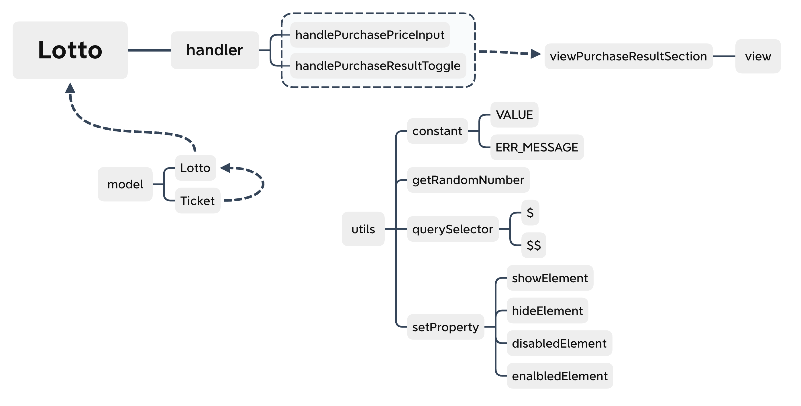

  

<h2 align="middle">level1 - 행운의 로또</h2>

자바스크립트로 구현 하는 로또 어플리케이션

## 🔥 Projects!

  

### 🎯 step1 구입 기능

- [x] 로또 구입 금액을 입력하면, 금액에 해당하는 로또를 발급해야 한다.
- [x] 로또 1장의 가격은 1,000원이다.
- [x] 소비자는 **자동 구매**를 할 수 있어야 한다.
- [x] 복권 번호는 번호보기 토글 버튼을 클릭하면, 볼 수 있어야 한다.

### 🗂 코드 구조 시각화

  

